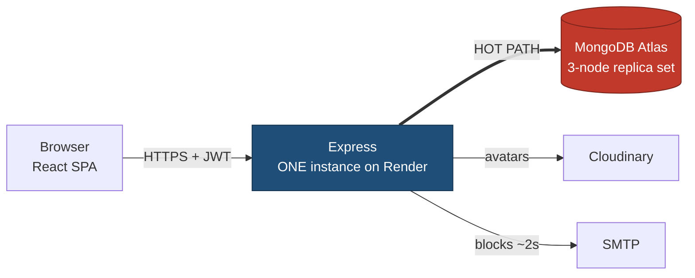
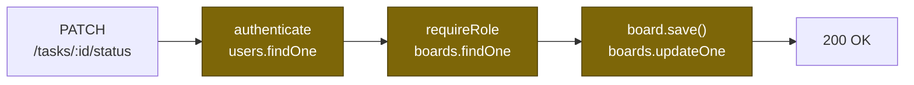
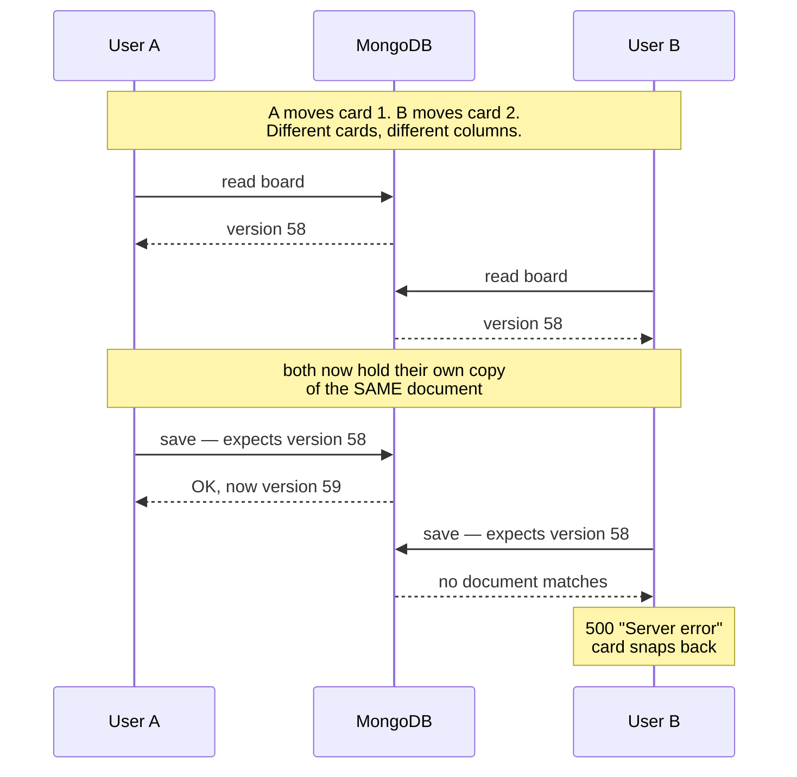

# KanbanFlow — Architecture

**Audit subject:** the Board module, with `PATCH /api/boards/:boardId/tasks/:taskId/status`
(the card move) as its hot path.

Three diagrams. Two answer exercise questions; the third is supporting detail.

| # | diagram | purpose |
|---|---|---|
| 1 | System map | **answers 1.5** — draw the architecture, mark the hot path |
| 2 | Cost of one card move | supporting detail for 3.3 — where the latency goes |
| 3 | Write collision | **answers 5.2** — the thing hardest to explain in words |

For the exercise, submit **diagram 1 for question 1.5** and **diagram 3 for question 5.2**.
Diagram 2 exists because "three sequential round trips" is clearer as three boxes
than as a sentence.

---

## 1. System map

**Compute** — one Node process. No load balancer, no horizontal scaling.
**Storage** — MongoDB Atlas. Reads only ever go to the primary; the two secondaries are never read.
**Cache** — *none.* No Redis, no HTTP caching. Every read hits the database.
**Queue** — *none.* The invite email is awaited inline on the request (~2 s).

### What one card move actually costs

Three **sequential** round trips to a database that is not local. Measured ping to
Atlas: 301 ms p50. The endpoint cannot beat roughly 560 ms no matter how well the
queries are indexed — the cost is travel, not work.

All eight write endpoints below end in `board.save()` on the **same document**:

| endpoint | method |
|---|---|
| `/:boardId/tasks` | POST |
| `/:boardId/tasks/:taskId` | PUT, DELETE |
| `/:boardId/tasks/:taskId/status` | PATCH ← **hottest** |
| `/:boardId/tasks/:taskId/subtasks/:subtaskId` | PATCH |
| `/:boardId/tasks/:taskId/assignees` | PATCH |
| `/:boardId` | PUT |
| `/:boardId/members/*` | POST, PUT, DELETE |

The hot key is therefore **one `_id` in the `boards` collection** — the busiest board.

---

## 2. Why two people moving *different* cards collide

The whole board — every column, task and subtask — is a single document. The read
and the write are separated by application logic, and nothing holds a lock across
that gap.

Mongoose adds the version guard because both handlers call `.pull()` on a
subdocument array. The guard is doing useful work — B is *rejected* rather than
silently overwriting A — but it surfaces as an untyped `500`, so the user sees a
failure with no explanation and no retry.

**Measured:** six unrelated cards moved simultaneously → **2 of 6 failed.**
Reproduce with `node scripts/concurrency-test.js`.

Counterintuitively, two people moving the **same** card is safe: the second
request finds it already in the target column and returns early without saving.
The collision nobody expects is the one that breaks.

---

## 3. Audit findings

| # | Finding | Status |
|---|---|---|
| 1 | No index on `userId` / `members.userId` — board list scanned all 5015 docs | **fixed** |
| 2 | `authenticate` ran up to 3× per request (three routers on one mount path) | **fixed** |
| 3 | Every error with a `.message` returned `400`, making the `500` branch unreachable | **fixed** |
| 4 | Unmatched `/api` routes returned HTML to JSON clients | **fixed** |
| 5 | `members[].email` never re-synced when a user changes their email | open |
| 6 | Board list returns every task and subtask — 32 MB / 18 s for a heavy user | open |
| 7 | `VersionError` from concurrent writes surfaces as an untyped `500` | open |
| 8 | SMTP send blocks the invite response — ~2 s handshake, no connection pooling | open |
| 9 | Connection opened with zero options — consistency defaults inherited, never chosen | open |
| 10 | Task `status` stored on the task *and* implied by its parent column | open |
| 11 | 16 MB BSON limit is a hard ceiling on board size | open |

Evidence for each is in [`audit/`](../audit/).
Proposed fixes for the open ones, with costs, are in [REMEDIATION.md](REMEDIATION.md).
