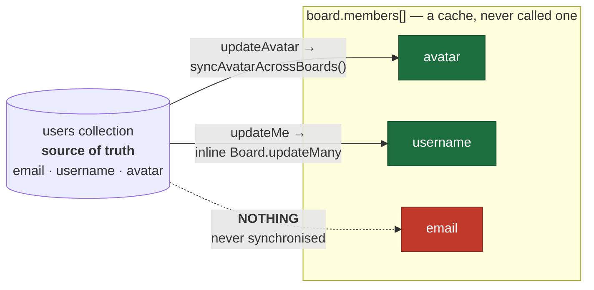

# ADR 0001 — Cache the user document with TTL expiry, not delete-on-write

**Status:** Accepted
**Date:** 2026-08-05
**Context:** performance audit of the Board module

---

## Context

Instrumentation over a 963-request session measured the read/write shape of every
collection:

| collection | reads | writes | read : write |
|---|---|---|---|
| `users` | 1369 | 0 | ∞ |
| `boards` | 964 | 405 | 2.4 : 1 |

The user document is read on every authenticated request — `authenticate` calls
`User.findById` before any handler runs — and written only on signup, profile
edit, or avatar change. In the entire session it was never written once.

Roughly 406 of those 1369 reads were a defect: board, task and member routes are
all mounted at `/api/boards` and each registered `authenticate`, so Express ran
it up to three times per request. That has been fixed separately. Even after the
fix, ~963 reads against 0 writes makes this the most cacheable object in the
system by a wide margin.

Two facts constrain the decision:

1. **A cache already exists and was never designed.** `board.members[]` stores
   copies of each user's `email`, `username` and `avatar` inside every board
   document. It has three different invalidation mechanisms and one field with
   none at all.
2. **The service runs as a single instance.** No shared cache is required for
   correctness today.

## The existing cache, and where it is broken

Three copied fields, three different mechanisms, living in three different files
— and `email` is never propagated at all. Verified by changing a user's email and
reading the board back: the `users` collection updated, `board.members[0].email`
kept the old address, and no TTL exists to ever correct it.

## Decision

If the user document is cached, it will be cached as:

- **Key:** `user:<id>`, taken from the verified JWT claim.
- **Store:** in-process `Map` while the service runs as one instance.
- **TTL:** 30–60 seconds.
- **Invalidation:** **expiry only.** No explicit delete-on-write.

**Ordering note:** the duplicate-authentication defect is fixed *first*. Caching
before fixing it would have hidden the redundant lookups behind cache hits — the
defect would have survived, invisible, with nobody able to find it in the
metrics. A cache that conceals a bug is worse than no cache.

## Alternatives considered

### Delete-on-write — rejected

Faster and strictly more correct than expiry *when every write path remembers to
invalidate*. Rejected on direct evidence from this codebase: it is already the
strategy used for `board.members[]`, and it is already wrong. Two of three fields
are synchronised, from two different places, and the third was missed entirely.

The failure mode is unbounded. A missed call site produces data that is wrong
**permanently**, with no mechanism that ever repairs it, discovered only when a
user reports it by hand.

This is a judgement about the team and the codebase, not about the technique.

### Versioned keys — rejected

Correct and elegant: embed a version in the key, bump it on write, old entries
become unreachable without deletion. Rejected as disproportionate. It requires a
version counter alongside every user record and an eviction policy for orphaned
entries — real complexity to solve a problem that a 60-second TTL solves for
free at this scale.

### Do nothing — rejected, but it is close

The strongest argument against caching at all: `authenticate` re-fetches data it
already holds. The JWT is signed, verified, and already carries the user id, and
most handlers use nothing else. **Removing the lookup entirely beats caching it.**

Not adopted here only because some handlers do need live user fields (`email`,
`username`, `avatar` when adding members), so the lookup cannot be deleted
outright without auditing every consumer. That audit is the better long-term fix
and this ADR should be revisited once it is done.

## Consequences

**Accepted:**
- A profile change may not be visible for up to 60 seconds.
- Staleness is bounded and self-healing. Worst case is a minute, never forever.
- Roughly one database round trip removed per authenticated request.

**Rejected deliberately:**
- Immediate consistency after a profile write.

**Revisit when:**
- The service scales beyond one instance — the in-process `Map` stops being
  coherent and must move to Redis or be dropped.
- The `authenticate` consumer audit completes and the lookup can be removed
  rather than cached.
- Any user-facing field becomes security-relevant (a role or permission stored
  on the user), where 60 seconds of staleness would be a privilege-escalation
  window rather than a cosmetic delay.

## Related

- The `email` field of `board.members[]` remains unsynchronised. That is a
  separate defect, not addressed by this ADR, and needs its own fix.
- `docs/ARCHITECTURE.md` — system map and the write-contention sequence diagram.
